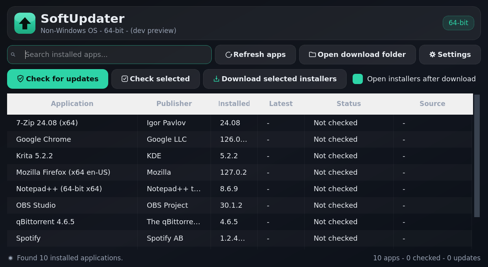
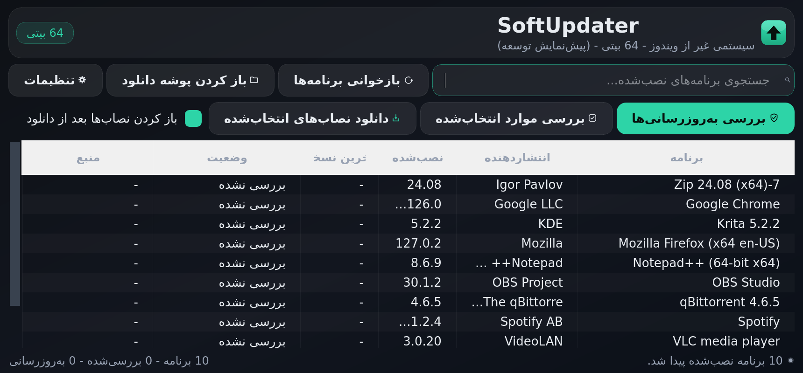

# SoftUpdater


**Check every installed Windows application against its official source —
GitHub Releases, vendor version feeds, official download servers — and see
at a glance which apps have updates.**

Free and open source (MIT). No telemetry, no accounts, no ads.

**English** | [**فارسی**](README.fa.md)

<p>
  
  
</p>

## Highlights

- Detects **all installed applications** from the Windows registry
  (HKLM 64/32 + HKCU) and your **Windows version** (7 → 11) and bitness.
- Finds the **latest version** of each app from its own *official* source:
  - GitHub Releases API for open-source apps (per-architecture asset matching)
  - Official vendor feeds for Chrome, Edge, Firefox, Thunderbird, VLC, GIMP,
    Blender, LibreOffice, Python, Node.js, Discord, KeePass, foobar2000, …
  - A GitHub name-search fallback for other open-source apps
- Clear per-app status: `Update available` / `Up to date` /
  `No installer for this OS` / `No source found` / `Check failed`.
- Picks the installer that matches **your architecture** (x64 vs x86) and
  downloads it to `Downloads\SoftUpdater` — **files are only saved, never
  executed**. You stay in control of what gets installed and when.
- Self-updating closed-source apps (Steam, Spotify, Office, antivirus, GPU
  drivers…) are labelled *vendor-managed* instead of "unavailable".
- **Six languages** with live switching — English, Persian, Arabic,
  Portuguese, French, German — and a real **right-to-left** layout for
  fa/ar (table, sidebar, menus, everything).
- Dark glassmorphism UI with a hand-painted Fluent-style vector icon set,
  a configurable font size (14–20 pt) and a colored status dot.
- Background threads + queued signals everywhere: resize or maximize
  during a check and nothing freezes or crashes.

## Download (official builds)

Grab the installers from the
[**Releases page**](https://github.com/BuiltByAmirali/SoftUpdater/releases):

| File | For |
|---|---|
| `SoftUpdater-Setup-<version>.exe` | Windows 10 / 11 — 64-bit |
| `SoftUpdater-Setup-<version>-win32.exe` | Windows 7 SP1 / 8 / 8.1 / 10 / 11 — 32- **and** 64-bit |

Unsure which to pick? Take the `-win32` one — it runs on all of the above.

**Verify your download** (recommended): every release ships a
`SHA256SUMS.txt` next to the installers. On Windows run:

```
certutil -hashfile SoftUpdater-Setup-<version>.exe SHA256
```

and compare the hash with the matching line in `SHA256SUMS.txt`.

> **Only this repository is official.** The app itself shows the official
> source under **Settings → About**. If a copy from somewhere else links a
> different repository, publisher or donation page, it is not official.

## Run from source

Double-click `run.bat` (or `python run.py`). Needs Python 3.10+ once —
the script creates its own venv and installs the dependencies
automatically.

## Build it yourself

- **Portable single EXE** — double-click `build.bat`:
  produces `dist\SoftUpdater\SoftUpdater.exe`.
- **Official installers** — double-click `build_installer.bat`
  (64-bit) and/or `build_installer32.bat` (Windows 7 / 32-bit):
  produces `dist\installer\SoftUpdater-Setup-<version>.exe` /
  `SoftUpdater-Setup-<version>-win32.exe` with PyInstaller + Inno Setup 6
  (Inno Setup is downloaded automatically if missing; per-user install,
  Start Menu + Desktop shortcuts, uninstaller, silent close of a running
  app — no admin/UAC prompt).
- **Release checksums** — after building, run `build\make_checksums.bat`
  to generate `dist\installer\SHA256SUMS.txt` for the upload.

The version comes from the single-line `VERSION` file — bump it for every
release; installing a newer build upgrades the previous one in place
(stable AppId, both lines share it). Every build step writes its own log
into the `build` folder and opens it automatically on failure.

## Privacy

- **No telemetry, no analytics, no accounts.** Nothing about you or your
  machine leaves it.
- Network access is limited to: the official sources of your apps
  (vendor feeds / api.github.com), the official download servers when
  *you* click download, and the public UniGetUI icon CDN for app icons.
- Logs stay local: `%LOCALAPPDATA%\SoftUpdater\logs\softupdater.log`,
  crashes in `%LOCALAPPDATA%\SoftUpdater\error.log`.

## Languages & first-run tour

Switch anytime in **Settings → Appearance → Language** — every window
re-translates itself in place, no restart; Persian/Arabic flip the whole
UI to RTL. The i18n engine is dependency-free with exact key/placeholder
parity across all six languages (enforced by the self-test and the audit
scripts in `build/`).

A four-page quick tour greets first-time users (dismissible forever;
re-enable it in Settings → Appearance).

## Self-test

```
python run.py --selftest
```

Offline checks of version comparison, name matching, catalog integrity
and platform detection — no GUI, no network.

## Project layout

```
run.py                     entry point + offline self-test
requirements.txt           PySide6, requests, packaging
requirements-win7.txt      PyQt5 5.15 line for Windows 7 / 32-bit
run.bat                    creates venv (once) and launches the app
build.bat                  portable build (PyInstaller)
build_installer.bat        official 64-bit Setup EXE (PyInstaller + Inno Setup)
build_installer32.bat      official Windows 7 / 32-bit Setup EXE
VERSION                    single-line release version
app/qt_compat.py           PySide6/PyQt5 compatibility facade (one codebase)
app/core/                  installed-apps, update sources, downloader, win_info
app/i18n/                  translation engine + en/fa/ar/pt/fr/de dictionaries
app/ui/                    main window, settings, onboarding, theme, icon kit
installer/                 Inno Setup scripts + license page + version resource
build/                     dev tools: offline tests, audits, zip packer, checksums
docs/screenshots/          the images used in this README
```

## Contributing

Issues and PRs in **English or Persian** are welcome — please read
[CONTRIBUTING.md](CONTRIBUTING.md) first (test suite + i18n parity + both
build lines). Security reports: [SECURITY.md](SECURITY.md).

## Changelog

See [CHANGELOG.md](CHANGELOG.md) for what changed in every version.

## Author

**BuiltByAmirali** — [github.com/BuiltByAmirali](https://github.com/BuiltByAmirali)

## License

[MIT](LICENSE) © 2025 BuiltByAmirali — free to use, study, modify and
share.

<!-- ============================================================
     SUPPORT / DONATION (uncomment when the donation link is live)
     Keep the donation link ONLY in this official repository and
     in the in-app About page - that is what makes it verifiable
     against fake forks. Suggested block:

     ## Support the project
     SoftUpdater is free and open source. If it saves you time:
     - Ko-fi / BuyMeACoffee: <your link>
     Every donation is optional - the app stays 100% free.
     ============================================================ -->
